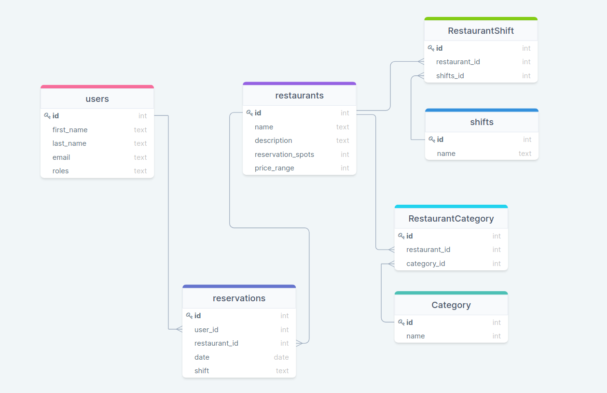

# Slowppi Backend

Ruby on Rails API for reservations.

## Table of contents

- [Overview](#overview)
  - [API Endpoint](#api-endpoint)
  - [Frontend](#frontend)
  - [Available scripts](#available-scripts)
- [My process](#my-process)
  - [Built with](#built-with)
- [Author](#author)

## Overview

### API Endpoint

- [GET] `slowppi-services.herokuapp.com/`

### Frontend

- [Repository](https://github.com/alonsofl/slowppi-frontend)

### Available scripts

- Clone this repository
```bash
$ git clone git@github.com:leonardodiasb/final-capstone-back-end.git
$ cd final-capstone-back-end/
```

- Seed the database
```bash
$ rails db:seed
```

- Start Rails server
```bash
$ rails s
```

- Start Rails console
```bash
$ rails c
```

### ERD Diagram



## Process

### Built with

- Ruby on Rails - API

## Authors

**Abimbola Buari**
- GitHub: [@bimbolabuari](https://github.com/bimbolabuari)
- Twitter: [@bimbolabuari](https://twitter.com/bimbolabuari)
- LinkedIn: [@bimbolabuari](https://www.linkedin.com/in/bimbolabuari)

**Alonso Falconi**
- GitHub - [@alonsofl](https://github.com/alonsofl)
- LinkedIn - [Alonso Falconi](https://www.linkedin.com/in/alonsofalconi/)

**Daniel Jaramillo**
- GitHub: [@d4nielj](https://github.com/d4nielj)
- Twitter: [@d4niel_jm](https://twitter.com/d4niel_jm)
- LinkedIn: [d4nielj](https://linkedin.com/in/d4nielj)

**Leonardo Dias**
 - GitHub: [@leonardodiasb](https://github.com/leonardodiasb)
 - Twitter: [@BussularDias](https://twitter.com/BussularDias)
 - LinkedIn: [Leonardo Dias Bussular](https://www.linkedin.com/in/leonardo-dias-bussular-a67392178/)

Give a ⭐️ if you like this project!